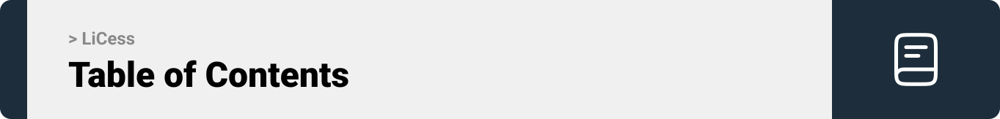
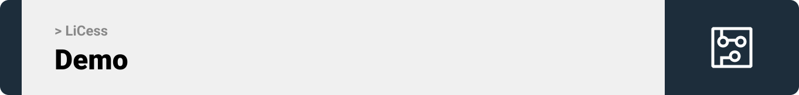
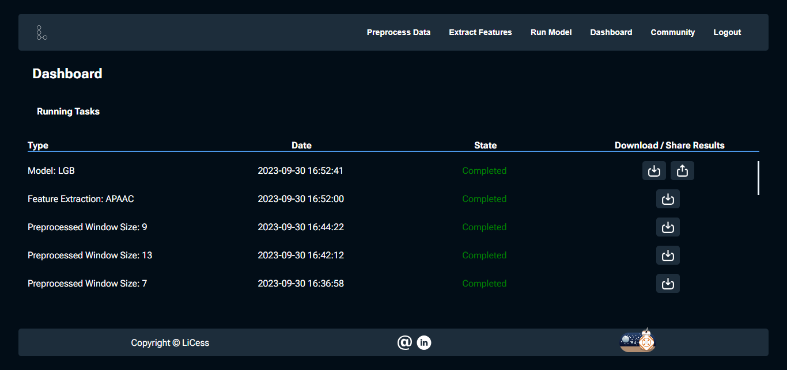
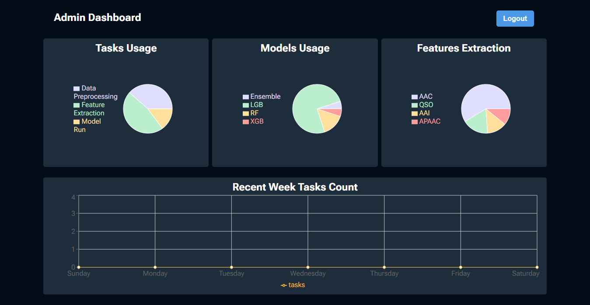
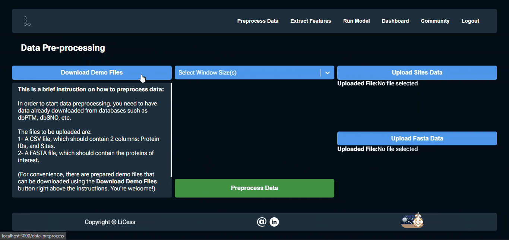
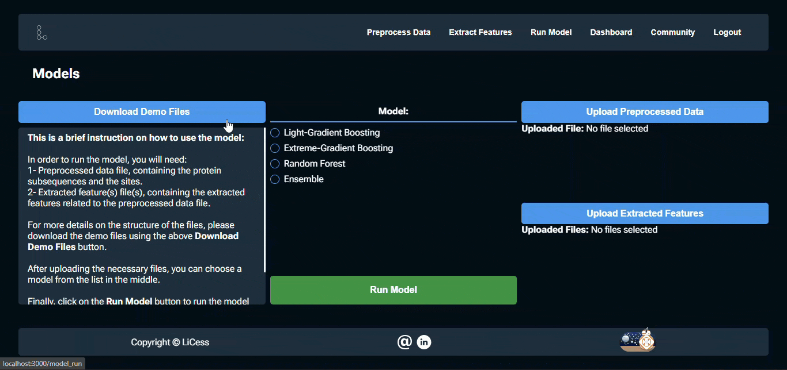
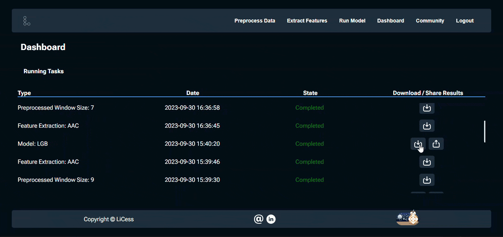

<br><br>

<!-- table of contents -->
 


- [Project Philosophy](#project-philosophy)
   - [User Types](#user-types)
   - [User Stories](#user-stories)
- [Prototyping](#prototyping)
- [Tech Stack](#tech-stack)
  - [Frontend](#Frontend)
  - [Backend](#Backend)
- [Demo](#Demo)
- [Performance](#Performance)
- [How to Run](#how-to-run)
  - [Prerequisites](#prerequisites)
  - [Installation](#installation)

<!-- project philosophy -->
<a name="project-philosophy"></a>


> An AI-Powered, Bioinformatics tool for predicting S-Nitrosylation (SNO) sites in proteins, helping in processes including - but not limited to - drug design, protein understanding...
>
> LiCess aims to provide a user-friendly experience for researchers interested in SNO-related studies and researches. It predicts the site of SNO in proteins using real-life data.

<a name="user-types"></a>
### User Types

1. Admin
2. User

<a name="user-stories"></a>
### User Stories

As a user, I want to:
- share my results on the website so that others can benefit from and compare my results.
- upload my data to the server so that the model tests it.
- download my results so that I can have them offline.
- upload my data to the server so that the model tests it.
- register to an account so that I can save my runs.
- login to an account so that I can check my runs’ history.
  <br>

As an admin, I want to:
- know the statistics related to all tasks so that I can optimize the models.
   <br><br>

<!-- Prototyping -->
<a name="prototyping"></a>


> We designed LiCess using wireframes and mockups, iterating on the design until we reached the ideal layout for easy navigation and a seamless user experience.

### Wireframes

| Landing screen                            | Features screen                       |
| --------------------------------------- | ------------------------------------- |
|  |  |

### Mockups

| Landing screen                             | Features Screen                           |
| --------------------------------------- | ------------------------------------- |
|  |  |

<br><br>

   <!-- Tech stack -->
<a name="tech-stack" ></a>


LiCess is built using the following technologies:

<a name="Frontend" ></a>
## Frontend (Website)
- This project uses the **React JavaScript library** (https://react.dev/). React is an open-source, JavaScript library which allows us to building user interfaces based on components.
<br>

<a name="Backend" ></a>
## Backend (Database)
- This project uses the **Laravel PHP framework** (https://laravel.com/) which follows the Model-View-Controller (MVC) design-pattern and provides a clean and elegant syntax that aims to simplify the development process.

<br><br>

<!-- Demo -->
<a name="Demo" ></a>


> Using the wireframes and mockups as a guide, we implemented the LiCess Project with the following features:

### User Screens

| Login screen                                          | Register screen                                             | Landing screen (hero)                                   |
| ----------------------------------------------------- | ----------------------------------------------------------- | ------------------------------------------------------- |
|         |         |  |
| Data Preprocessing Screen                             | Feature Extraction Screen                                   | Model Run Screen                                        |
|    |            |                   |
| Dashboard Screen                                      | Community Screen                                            | Landing screen (key features)                           |
|              |                    |  |

### Admin Screens

| Admin Dashboard screen                                |
| ----------------------------------------------------- |
|  |

### Demo GIFs

| Preprocess demo                                       |
| ----------------------------------------------------- |
|            |
In the Data-Preprocess screen, the user is provided with instructions on how to use this feature (shown on the left side if the screen). In short, the user can download demo files and then upload them using the respective buttons on the right side of the screen. Then, the user can choose window sizes of interest and click on the call-to-action button, which starts the preprocessing task. A modal pops up, prompting the user to go to the dashboard where the results of the related task can be downloaded. 
| Features demo                                       |
|            |
Similar to the preprocessing phase, the user can upload the data obtained from the preprocess action and extract features from it. The features available for the time being are: AAC, AAI, APAAC, Binary and QSO.
| Model demo                                       |
|            |
As for the model, the user can upload the data obtained from the previous steps and choose a model to run. Finally, the user can check the results in the dashboard.
| Dashboard-Community demo                                       |
|            |
The dashboard is where all the results are available for download. Moreover, the model-related results can be shared to a community in the form of a post, showing the obtained results and the model used, and a comment that the user can write above the post.
| Dark-Light demo                                       |
|            |
A simple dark-light theme switch


<br><br>

<!-- Performance -->
<a name="Performance" ></a>

The following test have been conduncted in Postman in order to asses the functionality of the project's main APIs:
| API Test Results                                       |
| ----------------------------------------------------- |
| Data Preprocess                                       |
|            |
| Feature Extraction                                        |
|            |
| Model Run                                        |
|            |

The time taken for each task of the key features: Data Preprocessing, Feature Extraction and Model Run provides promising results, varying between 45 seconds and around a minute. This, in fact, provides a great user experience.
<br>
🚨
- The source codes for data preprocessing, feature extraction and models are available on demand (which are external APIs called by Laravel).
<br>
- All the related postman collections can be found in the "postman" folder in the root directory.
<br><br>

<!-- How to run -->
<a name="how-to-run" ></a>


> To set up LiCess locally, follow these steps:

<a name="prerequisites"></a>

### Prerequisites

- **Node.js**:
  [https://nodejs.org/en/download](https://nodejs.org/en/download)
- **XAMPP**:
  [https://www.apachefriends.org/download.html](https://www.apachefriends.org/download.html)
- **Composer**:
  [https://getcomposer.org/download/](https://getcomposer.org/download/)
- **Postman**:
  [https://www.postman.com/downloads/](https://www.postman.com/downloads/)

<a name="installation"></a>

### Installation

#### Frontend-related steps:
1. Clone the repo
   ```sh
   git clone https://github.com/Mohamad-Rida-Chouman/LiCess-website.git
   ```
2. From the root folder, navigate to the client folder:
   ```sh
   cd client
   ```
3. Install the required dependencies:
   ```sh
   npm install
   ```
4. Run React's start-up command:
   ```sh
   npm run start
   ```

#### Database-related steps:
1. Launch XAMPP and start both Apache and MySQL services
2. In your browser, go to phpmyadmin:
   localhost/phpmyadmin/
3. Create a database with the name "licess".

#### Backend-related steps:
1. Navigate to the server folder:
   ```sh
   cd ../server
   ```
2. Install the required dependencies:
   ```sh
   composer install
   ```
3. Run Laravel's start up command:
   ```sh
   php artisan serve
   ```
4. Launch Postman and import the collections to the workspace.

Now, you should be able to run LiCess locally and explore its features.
