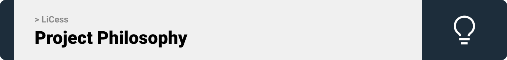
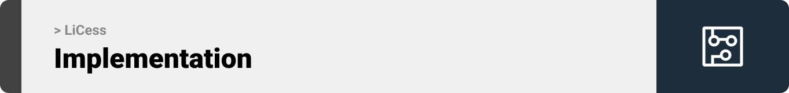
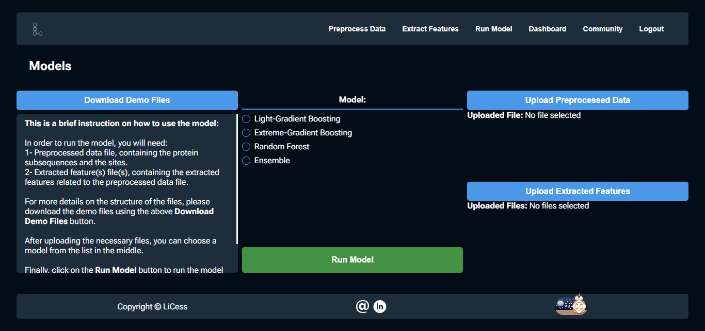

<br><br>

<!-- project philosophy -->


> An AI-Powered, Bioinformatics tool for predicting S-Nitrosylation (SNO) sites in proteins, helping in processes including - but not limited to - drug design, protein understanding...
>
> LiCess aims to provide a user-friendly experience for researchers interested in SNO-related studies and researches. It predicts the site of SNO in proteins using real-life data.

### User Stories

- As a user, I want to share my results on the website so that others can benefit from and compare my results.
- As a user, I want to upload my data to the server so that the model tests it.
- As a user, I want to download my results so that I can have them offline.
- As a user, I want to upload my data to the server so that the model tests it.
- As a user, I want to register to an account so that I can save my runs.
- As a user, I want to login to an account so that I can check my runs’ history.
  <br><br>

<!-- Prototyping -->


> We designed LiCess using wireframes and mockups, iterating on the design until we reached the ideal layout for easy navigation and a seamless user experience.

### Wireframes

| Landing screen                            | Features screen                       |
| --------------------------------------- | ------------------------------------- |
|  |  |

### Mockups

| Landing screen                             | Features Screen                           |
| --------------------------------------- | ------------------------------------- |
|  |  |

<br><br>

<!-- Implementation -->


> Using the wireframes and mockups as a guide, we implemented the LiCess Project with the following features:

### User Screens

| Login screen                                          | Register screen                                             | Landing screen (hero)                                   |
| ----------------------------------------------------- | ----------------------------------------------------------- | ------------------------------------------------------- |
|         |         |  |
| Data Preprocessing Screen                             | Feature Extraction Screen                                   | Model Run Screen                                        |
|    |            |                   |
| Dashboard Screen                                      | Community Screen                                            | Landing screen (key features)                           |
|              |                    |  |

### Admin Screens

| Admin Dashboard screen                                |
| ----------------------------------------------------- |
|  |

<br><br>

<!-- Tech stack -->


### LiCess is built using the following technologies:

- This project uses the [React JavaScript library](https://react.dev/). React is an open-source, JavaScript library which allows us to building user interfaces based on components.
- For backend (database), the project uses the [Laravel PHP framework](https://laravel.com/) which follows the Model-View-Controller (MVC) design-pattern and provides a clean and elegant syntax that aims to simplify the development process.
- The app uses the font ["Roboto"](https://fonts.google.com/specimen/Roboto) as its main font.

<br><br>

<!-- How to run -->


> To set up LiCess locally, follow these steps:

### Prerequisites
https://getcomposer.org/download/
- Node.js:
  [https://nodejs.org/en/download](https://nodejs.org/en/download)
- XAMPP:
  [https://www.apachefriends.org/download.html](https://www.apachefriends.org/download.html)
- Composer:
  [https://getcomposer.org/download/](https://getcomposer.org/download/)

### Installation

1. Clone the repo
   ```sh
   git clone https://github.com/Mohamad-Rida-Chouman/LiCess-website.git
   ```
2. From the root folder, navigate to the client folder:
   ```sh
   cd client
   ```
3. Enter your API in `config.js`
   ```js
   const API_KEY = 'ENTER YOUR API';
   ```

Now, you should be able to run LiCess locally and explore its features.
